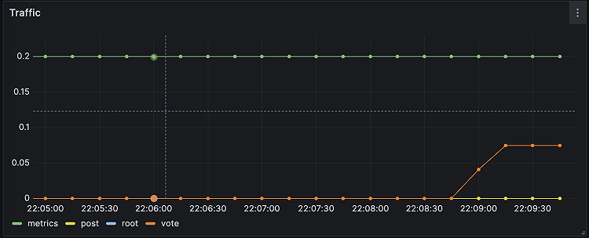
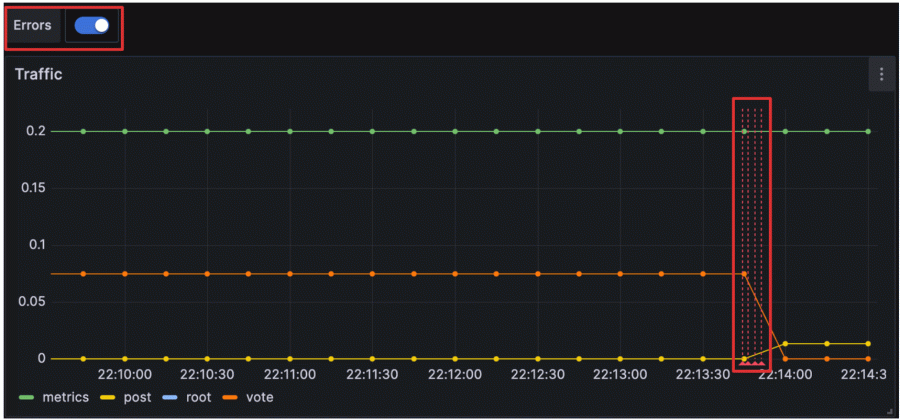
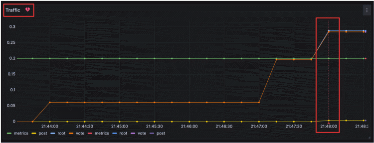

# Introduction

In this tutorial, you’ll learn how to use Grafana to set up a monitoring solution for your application, and:

- Explore metrics and logs
- Build dashboards
- Annotate dashboards
- Set up alert rules


# Prerequisites

- Docker
- Docker Compose (included in Docker for Desktop for macOS and Windows)
- Git

# Set up the sample application

This tutorial uses a sample application to demonstrate some of the features in Grafana. To complete the exercises in this tutorial, you need to download the files to your local machine.

In this step, you’ll set up the sample application, as well as supporting services, such as Loki.

**Note:** Prometheus, a popular time series database (TSDB), has already been configured as a data source as part of this tutorial.

1. Clone the resposity

```
git clone 
```
2. Change to the directoy where you cloned this repository
```
cd 
```
3. Make sure Dock is running
```
docker ps
```
No errors means it is running. If you get an error, then start Docker and then run the command again.

4. Start the sample application
```
docker compose up -d
```

The first time you run docker-compose up -d, Docker downloads all the necessary resources for the tutorial. This might take a few minutes, depending on your internet connection.

**Note:** If you already have Grafana, Loki, or Prometheus running on your system, then you might see errors because the Docker image is trying to use ports that your local installations are already using. Stop the services, then run the command again.

Ensure all services are up-and-running:

```
docker-compose ps
```

In the State column, it should say Up for all services.

Browse to the sample application on http://localhost:8081.

# Grafana News

The sample application, Grafana News, lets you post links and vote for the ones you like.

To add a link:

In Title, enter Example.

In URL, enter https://something.com.

Click Submit to add the link.

The link appears in the list under the Grafana News heading.

To vote for a link, click the triangle icon next to the name of the link.

# Open Grafana
Grafana is an open source platform for monitoring and observability that lets you visualize and explore the state of your systems.

Open a new tab.
Browse to http://localhost:3000.

**Note**

This demo does not require a login page or credentials. However, if you choose to install Grafana locally, you need to log in and provide credentials. In that case, the default username and password is admin.

The first thing you see is the Home dashboard, which helps you get started.

In the top left corner, you can see the menu icon. Clicking it opens the sidebar, the main menu for navigating Grafana.

# Explore your metrics

Grafana Explore is a workflow for troubleshooting and data exploration. In this step, you’ll be using Explore to create ad-hoc queries to understand the metrics exposed by the sample application. Specifically, you’ll explore requests received by the sample application.

Ad-hoc queries are queries that are made interactively, with the purpose of exploring data. An ad-hoc query is commonly followed by another, more specific query.

1. Click the menu icon and, in the sidebar, click Explore. A dropdown menu for the list of available data sources is on the upper-left side. The Prometheus data source should already be selected. If not, choose Prometheus.

2. Confirm that you’re in code mode by checking the Builder/Code toggle at the top right corner of the query panel.

3. In the query editor, where it says Enter a PromQL query…, enter ```tns_request_duration_seconds_count``` and then press Shift + Enter. A graph appears.

4. In the top right corner, click the dropdown arrow on the Run Query button, and then select 5s. Grafana runs your query and updates the graph every 5 seconds.

You just made your first PromQL query! PromQL is a powerful query language that lets you select and aggregate time series data stored in Prometheus.

```tns_request_duration_seconds_count``` is a counter, a type of metric whose value only ever increases. Rather than visualizing the actual value, you can use counters to calculate the rate of change, i.e. how fast the value increases.

5. Add the ```rate``` function to your query to visualize the rate of requests per second. Enter the following in the query editor and then press Shift + Enter.

```
rate(tns_request_duration_seconds_count[5m])
```

Immediately below the graph there’s an area where each time series is listed with a colored icon next to it. This area is called the legend.

PromQL lets you group the time series by their labels, using the sum aggregation operator.

6. Add the sum aggregation operator to your query to group time series by route:

```
sum(rate(tns_request_duration_seconds_count[5m])) by(route)
```

7. Go back to the sample application and generate some traffic by adding new links, voting, or just refresh the browser.

8. Back in Grafana, in the upper-right corner, click the time picker, and select Last 5 minutes. By zooming in on the last few minutes, it’s easier to see when you receive new data.

Depending on your use case, you might want to group on other labels. Try grouping by other labels, such as ```status_code```, by changing the ```by(route)``` part of the query to ```by(status_code)```.

# Add a logging data source

Grafana supports log data sources, like Loki. Just like for metrics, you first need to add your data source to Grafana.

1. Click the menu icon and, in the sidebar, click Connections and then Data sources.
2. Click + Add new data source.
3. In the list of data sources, click Loki.
4. In the URL box, enter ```http://loki:3100```
5. Scroll to the bottom of the page and click Save & Test to save your changes.

You should see the message “Data source successfully connected.” Loki is now available as a data source in Grafana.

# Explore your logs

Grafana Explore not only lets you make ad-hoc queries for metrics, but lets you explore your logs as well.

1. Click the menu icon and, in the sidebar, click Explore.

2. In the data source list at the top, select the Loki data source.

3. Confirm that you’re in code mode by checking the Builder/Code toggle at the top right corner of the query panel.

4. Enter the following in the query editor, and then press Shift + Enter:

```
{filename="/var/log/tns-app.log"}
```

5. Grafana displays all logs within the log file of the sample application. The height of each bar in the graph encodes the number of logs that were generated at that time.

6. Click and drag across the bars in the graph to filter logs based on time.

Not only does Loki let you filter logs based on labels, but on specific occurrences.

Let’s generate an error, and analyze it with Explore.

1. In the sample application, post a new link without a URL to generate an error in your browser that says empty url.

2. Go back to Grafana and enter the following query to filter log lines based on a substring:

```
{filename="/var/log/tns-app.log"} |= "error"
```

3. Click the log line that says level=error msg="empty url" to see more information about the error.

***Note:*** If you’re in Live mode, clicking logs does not show more information about the error. Instead, stop and exit the live stream, then click the log line there.

Logs are helpful for understanding what went wrong. Later in this tutorial, you’ll see how you can correlate logs with metrics from Prometheus to better understand the context of the error.

# Build a dashboard
A dashboard gives you an at-a-glance view of your data and lets you track metrics through different visualizations.

Dashboards consist of panels, each representing a part of the story you want your dashboard to tell.

Every panel consists of a query and a visualization. The query defines what data you want to display, whereas the visualization defines how the data is displayed.

1. Click the menu icon and, in the sidebar, click ***Dashboards***.

2. On the Dashboards page, click New in top right corner and select New Dashboard in the drop-down.

3. Click + Add visualization.

4. In the modal that opens, select the Prometheus data source that you just added.

5. n the Query tab below the graph, enter the query from earlier and then press Shift + Enter:

```
sum(rate(tns_request_duration_seconds_count[5m])) by(route)
```

6. In the panel editor on the right, under Panel options, change the panel title to “Traffic”.

7. Click Apply in the top-right corner to save the panel and go back to the dashboard view.

8. Click the Save dashboard (disk) icon at the top of the dashboard to save your dashboard.

9. Enter a name in the Dashboard name field and then click Save.

You should now have a panel added to your dashboard.



# Annotate events

When things go bad, it often helps if you understand the context in which the failure occurred. Time of last deploy, system changes, or database migration can offer insight into what might have caused an outage. Annotations allow you to represent such events directly on your graphs.

In the next part of the tutorial, we simulate some common use cases that someone would add annotations for.

1. To manually add an annotation, click anywhere in your graph, then click ***Add annotation***. Note: you might need to save the dashboard first.

2. In ***Description***, enter ***Migrated user database***.

3. Click Save.

Grafana adds your annotation to the graph. Hover your mouse over the base of the annotation to read the text.

Grafana also lets you annotate a time interval, with region annotations.

Add a region annotation:

1.  Ctrl (or Cmd on macOS) and hold, then click and drag across the graph to select an area.
2. In ***Description***, enter ***Performed load tests***.
3. In ***Tags***, enter ***testing***.
4. Click ***Save***.

# Using annotations to correlate logs with metrics

Manually annotating your dashboard is fine for those single events. For regularly occurring events, such as deploying a new release, Grafana supports querying annotations from one of your data sources. Let’s create an annotation using the Loki data source we added earlier.

1. At the top of the dashboard, click the Dashboard settings (gear) icon.
2. Go to Annotations and click Add annotation query.
3. In Name, enter Errors.
4. In Data source, select Loki.
5. In Query, enter the following query:

```
{filename="/var/log/tns-app.log"} |= "error"
```

6. Click Apply. Grafana displays the Annotations list, with your new annotation.

7. Click your dashboard name to return to your dashboard.

8. At the top of your dashboard, there is now a toggle to display the results of the newly created annotation query. Press it if it’s not already enabled.

9. Click the Save dashboard (disk) icon to save the changes.

10. To test the changes, go back to the sample application, post a new link without a URL to generate an error in your browser that says empty url.

The log lines returned by your query are now displayed as annotations in the graph.



Being able to combine data from multiple data sources in one graph allows you to correlate information from both Prometheus and Loki.

Annotations also work very well alongside alert rules. In the next and final section, we set up an alert rules for our app ```grafana.news``` and then we trigger it. This provides a quick intro to our new Alerting platform.

# Create a Grafana-managed alert rule

Alert rules allow you to identify problems in your system moments after they occur. By quickly identifying unintended changes in your system, you can minimize disruptions to your services.

Grafana’s new alerting platform debuted with Grafana 8. A year later, with Grafana 9, it became the default alerting method. In this step we create a Grafana-managed alert rule. Then we trigger our new alert rule and send a test message to a dummy endpoint.

The most basic alert rule consists of two parts:

1. A Contact point - A Contact point defines how Grafana delivers an alert instance. When the conditions of an alert rule are met, Grafana notifies the contact points, or channels, configured for that alert rule.

***Note***

An alert instance is a specific occurrence that matches a condition defined by an alert rule, such as when the rate of requests for a specific route suddenly increases.

Some popular channels include:
<ol>
<li>Email</li>
<li>Webhooks</li>
<li>Telegram</li>
<li>Slack</li>
<li>PagerDuty</li>
</ol>

An Alert rule - An Alert rule defines one or more conditions that Grafana regularly evaluates. When these evaluations meet the rule’s criteria, the alert rule is triggered.

To begin, let’s set up a webhook contact point. Once we have a usable endpoint, we write an alert rule and trigger a notification.

# Create a contact point for Grafana-managed alert rules
In this step, we set up a new contact point. This contact point uses the webhooks channel. In order to make this work, we also need an endpoint for our webhook channel to receive the alert notification. We can use Webhook.site to quickly set up that test endpoint. This way we can make sure that our alert manager is actually sending a notification somewhere.

1. Browse to Webhook.site.
2. Copy Your unique URL.

Your webhook endpoint is now waiting for the first request.

Next, let’s configure a Contact Point in Grafana’s Alerting UI to send notifications to our webhook endpoint.

1. Return to Grafana. In Grafana’s sidebar, hover over the Alerting (bell) icon and then click Manage Contact points.

2. Click + Add contact point.

3. In Name, write Webhook.

4. In Integration, choose Webhook.

5. In URL, paste the endpoint to your webhook endpoint.

6. Click Test, and then click Send test notification to send a test alert notification to your webhook endpoint.

7. Navigate back to the webhook endpoint you created earlier. On the left side, there’s now a POST / entry. Click it to see what information Grafana sent.

8. Return to Grafana and click Save contact point.

We have now created a dummy webhook endpoint and created a new Alerting Contact Point in Grafana. Now we can create an alert rule and link it to this new channel.

# Add an alert rule to Grafana
Now that Grafana knows how to notify us, it’s time to set up an alert rule:

1. In Grafana’s sidebar, hover over the Alerting (bell) icon and then click Alert rules.

In this tutorial, we use the advanced options for Grafana-managed alert rule creation. The advanced options let us define queries, expressions (used to manipulate the data), and the condition that must be met for the alert to be triggered (the default condition is the threshold).

2. Click + New alert rule.

3. For Section 1, name the rule fundamentals-test.

4. For Section 2, toggle the Advanced options button.

5. Find the query A box, and choose your Prometheus data source.

6. Enter the same Prometheus query that we used in our earlier panel:

```
sum(rate(tns_request_duration_seconds_count[5m])) by(route)
```

7. Keep expressions B and C as they are. These expressions (Reduce and Threshold, respectively) are included by default when creating a new rule. Enter 0.2 as threshold value. You can read more about queries and conditions here.

8. Scroll down to bottom of section #2 and click the Preview button. You should see some data returned.

9. In Section 3, in Folder, create a new folder, by clicking New folder and typing a name for the folder. This folder contains our alert rules. For example: fundamentals. Then, click create.

10. In the Evaluation group, repeat the above step to create a new one. Name it fundamentals too.

11. Choose an Evaluation interval (how often the alert rule are evaluated). For example, every 10s (10 seconds).

12. Set the pending period. This is the time that a condition has to be met until the alert instance enters in Firing state and a notification is sent. Enter 0s. For the purposes of this tutorial, the evaluation interval is intentionally short. This makes it easier to test. This setting makes Grafana wait until an alert instance has fired for a given time before Grafana sends the notification.

13. In ***Section 4***, choose ***Webhook*** as the ***Contact point***.

14. Click Save rule and exit at the top of the page.

# Trigger a Grafana-managed alert rule

We have now configured an alert rule and a contact point. Now let’s see if we can trigger a Grafana-managed alert rule by generating some traffic on our sample application.

1. Browse to **[localhost:8081](http://localhost:8081)**.
2. Add a new title and URL, repeatedly click the vote button, or refresh the page to generate a traffic spike.

Once the query ```sum(rate(tns_request_duration_seconds_count[5m]))``` by(route) returns a value greater than 0.2 Grafana triggers our alert rule. Browse to the webhook endpoint we created earlier and find the sent Grafana alert notification with details and metadata.

***Note***

The alert rule may be triggered by the ```/metrics``` endpoint which is frequently accessed by Grafana when pulling metrics from the application. If this happens, you can increase the Threshold value in Section 2 for testing purposes.

# Display Grafana-managed alert rules to your dashboard
In most cases, it’s also valuable to display Grafana alert instances as annotations to your dashboard. Check out the video tutorial below to learn how to display alerting to your dashboard.

Let’s see how we can configure this.

1. In Grafana’s sidebar, hover over the ***Alerting*** (bell) icon and then click ***Alert rules***.

2. Expand the ```fundamentals > fundamentals``` folder to view our created alert rule.

3. Click the Edit icon and scroll down to Section 5.

4. Click the ***Link dashboard and panel*** button and select the dashboard and panel to which you want the alert instance to be added as an annotation.

5. Click ***Confir***m and ***Save rule and exit*** to save all the changes.

6. In Grafana’s sidebar, navigate to the dashboard by clicking Dashboards and selecting the dashboard you created.

7. To test the changes, follow the steps listed to trigger a Grafana-managed alert rule.

You should now see a red, broken heart icon beside the panel name, indicating that the alert rule has been triggered. An annotation for the alert instance, represented as a vertical red line, is also displayed.




# Summary
In this tutorial you learned about fundamental features of Grafana. To do so, we ran several Docker containers on your local machine. When you are ready to clean up this local tutorial environment, run the following command:

```
docker-compose down -v
```